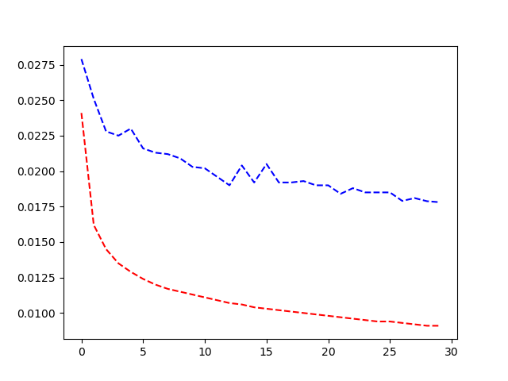

# Projet-2020 Deep Larning 

# PROBLEMATIC:
Apply a deep learning model on a large data set to predict traffic volume data. The main steps of this project are:
- Determine the model architecture and the form of data that will be imputed
- Determine a predition window, a training window and a sliding step of our training window that gives solid performances
- Adjust Hyperparameters
- Run multiple tests.
We were provided with the dataset Radar_Traffic_Counts.csv from the kaggle website that comprises of radar traffic counts in multiple locations over multiple directions that were 
taken every 15 minutes or so. 

# Dataset presentation:
Data was taken from kaggle (https://www.kaggle.com/vinayshanbhag/radar-traffic-data). Traffic data collected from the several Wavetronix radar sensors deployed by the City of Austin. Dataset is augmented with geo coordinates from sensor location dataset.
Source: https://data.austintexas.gov/. 
It contains the following features :
- Location
- Longitude
- Lattitude
- Direction
- TimeStamp
- DayofWeek
- Minute
- Hour
- Day
- Month
- Year
- Volume

# First Step: Data preprocessing
In this step, I first rearranged the data by deleting irrelevant columns, I then summed the traffic count over each hour, to simplify the data and thus the model to create.
Then I have sorted the values over the timestamp for the hourly traffic volume. Finally, To have enough entries we only keep the couples location, direction that verify number of hourly volume values >10 000
After this step, I tried two options, thus two imput types for my final model, I first determined a time series over each couple (location, direction). 
The second imput I tried comprised of a horizantally stacked array containing all the time series truncated at the minimum length than is reached by all the series 11491 in my case.
There are 33 couples (location,direction) that verify volume count > 10000. So my first imput consisted of 1 series of these 33 possible series, and my idea initially was to train my model
for each serie. My second imput contained 11491*33 elements, corresponding to the horizantal stack of my series.
The idea behind this second type of imput is that when I calculated the distances between the locations, it turned out the max distance was of about 18km, so I used this 
imput to keep the patterns by which the volume of traffic between these locations can interfere. It is not a typical time series, but a simple representation of a multivariate
time series.

# Prediction Window :
The final imput I used is a prediction of all the 33 locations over the next hour based on data from the previous 24 hours over all these locations, I finally chose a
sliding step of 1 hour, and a base training window of 24 hours.
My training set comprised of 80% of available data, and my test set of the remaining 20%. My training set contained roughly 9533 samples 
(each of size 33*24 / 33 being the number of (locations,direction) / 24 being the length of my base training window)
My test set contained 11914-9533 samples of same size.

# Model Definition :
The model I used is a convolutional neural network comprising of 2 convolutional layers and 3 linear layers, with an ouput of 33, each corresponding to a (location,direction), my learning rate was 0.0001 (a higher rate caused overfitting).
Many adjustments were made throughout the project duration and this final model was retained :

## MODEL        
        
    def __init__(self):
        super(TimeCNN, self).__init__()
        #Convolutional Layer 1
        self.layer1 = nn.Sequential(
            nn.Conv1d(in_channels=1, out_channels=64, kernel_size=3, padding=1),
            nn.ReLU(),
            nn.MaxPool1d(kernel_size=3, stride=2)
        )
        #Convolutional layer 2
        self.layer2 = nn.Sequential(
            nn.Conv1d(in_channels=64, out_channels=256, kernel_size=3),
            nn.ReLU(),
            nn.AdaptiveMaxPool1d(8)
        )#Linear Layer 1
        self.fc1 = nn.Linear(in_features=256*8, out_features=128*8)
        #Linear Layer 2
        self.drop=nn.Dropout2d(0.0)
        self.fc2 = nn.Linear(in_features=128*8, out_features=128*4)
        self.fc3 = nn.Linear(in_features=128*4, out_features=33)
    def forward(self, x):
        out = self.layer1(x)
        out = self.layer2(out)
        out = out.view(out.size(0), -1)
        out = self.fc1(out)
        out=self.drop(out)
        out = self.fc2(out)
        out=self.fc3(out)
        return out
        
        
        
# Loss Study:
The first approach consisting of predictions for each couple (location,direction) didnt seem to have a good loss compared to the second model I tried. The loss in this case actually decreased for both the 
training and test sets over the epochs, which showed my model was effective to a certain extent. The major drawback however is that it took a long time to run, which made parameter
tuning harder.

My model is slightly overfitting here, but the loss seems to be acceptable, although further improvments would have made the model better,they were hard due to the complexity of data, and the parameters made it hard to find a good compromise. 

